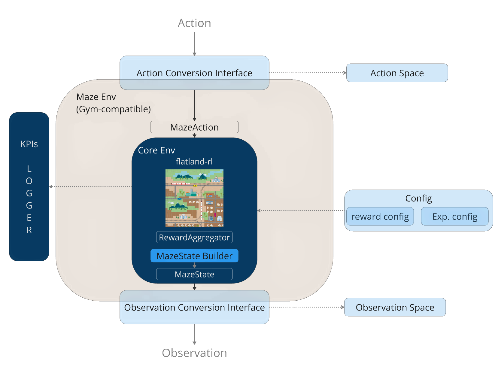
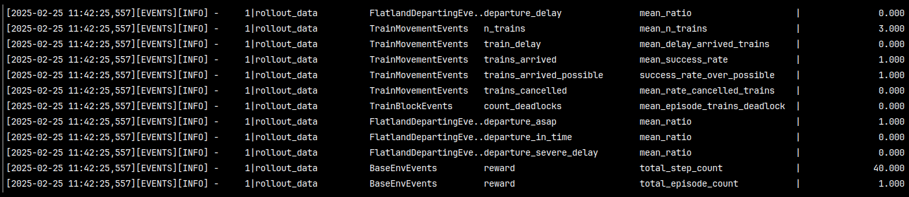
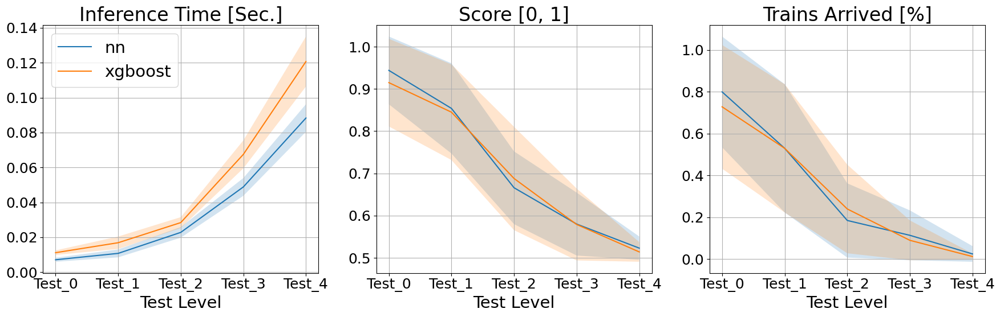

# Maze-Flatland
**Maze-Flatland** wraps and extends the [flatland-rl](https://github.com/flatland-association/flatland-rl) environment in [maze-rl](https://maze-rl.readthedocs.io/en/latest/),
making it a powerful AI training ground:
- optimized for **multi-agent decision-making**
- provides built-in functionalities to **improve sample efficiency**
- **lowers the exploration burden** for agents
- **provides insights** into the behavior of train-agents
- implements **extensive logging** that can be easily be extended.

| <b> Maze-Flatland </b> - Environment architecture |
|:-----------------------------------------------:|
|  |


## Supported by
| <a href="https://maze-rl.readthedocs.io/en/latest/">  </a> | <a href="https://www.enlite.ai/">  </a> | <a href="https://ai4realnet.eu">  </a> |
|:----------------------------------------------------------------------------------------------------------------|---------------------------------------------------------------------------------------|-----------------------------------------------------------------------------------------------:|

## Table of Contents
1. [Key Features](#key-features)
2. [Setup](#setup)
3. [Running Rollouts and Training](#running-rollout-and-training)
4. [Offline Training](#offline-training)
5. [References](#references)
6. [Contacts](#contacts)
7. [Acknowledgements](#Acknowledgements)


## Key Features

- **Masking and Skipping** for better sample efficiency. Prevents illegal actions and skips unnecessary decision where
a single option is available.
- **Designed for multi-agent reinforcement learning (MARL)**. Sequential multi-agent decision-making is supported.
- **Customizable configurations** for different training scenarios with YAML files.
- Built-in **KPIs** and **events** for comprehensive performance tracking and analysis.

## Setup

- Create a conda environment from the `environment.yml`
> **Note:** The default name for the environment is maze-flatland.
```bash
conda env create --file environment.yml
```
> **Note:** The default version of flatland-rl is the stable version **4.0.1**.
> Modify the `environment.yml` if another version is needed and run the tests to ensure full compatibility.
- Activate the conda environment:
```bash
conda activate maze-flatland
```
- Install **maze-flatland** locally:
```bash
pip install -e .
```
> **Note:** the editable mode (`-e`) option is essential to facilitate the modification and creation of new experiment (`yaml`) files without re-installing.
- Install **maze-rl** library
```bash
pip install git+https://github.com/enlite-ai/maze.git@dev
```

### Test the installation
Run a rollout with a greedy policy:
```bash
maze-run +experiment=multi_train/rollout/heuristic/simple_greedy
```
This performs 1 rollout with 3 trains and prints the resulting performance statistics to the command line, similarly to the given example



The statistics are saved in a rollout directory using the format: `outputs/yyyy-mm-dd/hh-mm-ss/` from the working directory.


## Running Rollouts and Training
Every experiment is launched by the **maze-run** command.

### Training
Replace `<path/to/yaml/exp>` with your target experiment. E.g. `offline/train/bc_train`.<br>
All the experiment files are stored at `maze-flatland/maze_flatland/conf/experiment/`.
```bash
maze-run -cn conf_train +experiment=<path/to/yaml/exp>
```
### Testing

Replace `<path/to/yaml/exp>` with your target experiment. E.g. `multi_train/rollout/heuristic/simple_greedy`. <br>
```bash
maze-run +experiment=<path/to/yaml/exp>
```

You can override the configuration by modifying the yaml file or at the command line level:
```bash
maze-run +experiment=multi_train/rollout/heuristic/simple_greedy env._.n_trains=15 env._.map_height=40 env._.map_width=40 runner.n_episodes=10
```
Here we run 10 episodes (`runner.n_episodes=10`) on a 40x40 map (`env._.map_height=40` and `env._.map_width=40`)
with 15 trains (`env._.n_trains=15`).

### Using wrappers

You can also launch experiments with wrappers defined at `maze-flatland/maze_flatland/conf/wrappers`.
- **masking** and **skipping** wrappers (`sub_step_skipping_monitored`). Automatically skips decision-making when only one viable option exists.
```bash
maze-run +experiment=multi_train/rollout/heuristic/simple_greedy wrappers=sub_step_skipping_monitored
```

- **rendering** wrapper (`renderer`). It stores a step-by-step rendering of the ongoing episode in a dedicated folder named `rendered_states` in the output directory.
```bash
maze-run +experiment=multi_train/rollout/heuristic/simple_greedy wrappers=renderer
```
- **dataset creator** wrapper (`spaces_recording`). It stores the experience for offline training from the rolled out episode(s) in a dedicated folder named `spaces_records` in the output directory.
```bash
maze-run +experiment=multi_train/rollout/heuristic/simple_greedy wrappers=spaces_recording
```

Additionally, you can stack multiple wrappers.
Beware of the order used for the wrappers.
The first is the outmost wrapper.
<br> In this case, if we reverse the order of the wrappers,
the experience batch will include the agent-environment interactions that were skipped.
```bash
maze-run +experiment=multi_train/rollout/heuristic/simple_greedy wrappers=[renderer,spaces_recording,sub_step_skipping_monitored]
```

## Offline training
To follow, we list the steps to be followed to train a policy.
### Behavioral cloning

To get started, we provide a ready-to-use dataset for training an agent. You can either download, extract and use this [dataset](https://drive.google.com/file/d/1FW6FnAKHgXXu_LDbdeWQR32jtTQeFc5o) or proceed to the data collection phase.

---
<dl>
  <dd>
    <dl>
      <dd>

#####   Data collection [optional]
1) Collect 500 trajectories using the `spaces_recording` wrapper:
> **Tip:** Using the `parallel` runner you can set the number of processes used to collect the data `runner.n_processes=20`
```bash
maze-run +experiment=multi_train/rollout/heuristic/simple_greedy wrappers=[sub_step_skipping_monitored,spaces_recording] runner=parallel runner.n_processes=5 runner.n_episodes=500
```
> **Note:** You can replace the greedy agent with any other existing agent, both heuristic or trained.
2) We have now collected our dataset at `/outputs/yyyy-mm-dd/hh-mm-ss/space_records/`

      </dd>
    </dl>
  </dd>
</dl>

---

##### Training phase

1) Finally, we can train with behavioral cloning our torch policy:
```bash
maze-run -cn conf_train +experiment=offline/train/bc_train trajectories_data=<replace/with/path/to/dataset>
```
> **Note:** `<replace/with/path/to/dataset>` can be a single `.pkl` file, a directory containing multiple `.pkl` files or a list of the previous.

2) Now we have our trained policy at the output directory:
`./flatland_result/BC_offline-v2.2/decision_point_mask/multi_train/ma_reduced_action_space-masked_flatland-bc-local/yyyy-mm-dd_hh-mm-sssss`
3) Rollout the trained policy:

```bash
maze-run +experiment=multi_train/rollout/torch_policy_masked input_dir=<replace/with/your/output/directory/>
```
As default, the `state_dict.pt` is used to run the rollout as this holds the weights of the best performing policy. <br>
To use a policy at a certain checkpoint specify the `policy.state_dict_file` to use. As an example,
```bash
maze-run +experiment=multi_train/rollout/torch_policy_masked input_dir=<replace/with/your/output/directory/> policy.state_dict_file=state_dict-epoch_80.pt
```
### XGBoost
XGBoost is a powerful gradient boosting algorithm leveraging optimized tree-based learning to map tabular data to predictions,
or action space in this case, excelling in speed and accuracy. [Learn more about XGBoost](https://xgboost.readthedocs.io/en/stable/).

Similarly as for behavioral cloning, you can use the ready-to-use [dataset](https://drive.google.com/file/d/1FW6FnAKHgXXu_LDbdeWQR32jtTQeFc5o) or proceed with the data collection phase.

---
<dl>
  <dd>
    <dl>
      <dd>

#####   Data collection [optional]

- First, if using custom observation, we need to flatten the observation (`obs_aggregator_flattening` wrapper) to obtain tabular data
compatible with xgboost.
- Second, the first and last actions (`DO_NOTHING` and `STOP_MOVING`) need to be at least once in the dataset as XGBoost infers the labels from the dataset.
This could be achieved by setting the `do_skipping_in_reset` to `false` in the skipping wrapper at the `maze_flatland/conf/wrappers/sub_step_skipping_monitored.yaml` file and by replacing the greedy policy with a random one.


1) Start data collection:
```bash
maze-run +experiment=multi_train/rollout/heuristic/simple_greedy wrappers=[sub_step_skipping_monitored,obs_aggregator_flattening,spaces_recording] runner=parallel runner.n_processes=5 runner.n_episodes=500 policy=masked_random_policy
```
2) We have now collected our dataset at `/outputs/yyyy-mm-dd/hh-mm-ss/space_records/`
      </dd>
    </dl>
  </dd>
</dl>

---

1) Finally, we can proceed with training:
```bash
maze-run -cn conf_train +experiment=offline/train/xgboost_train trajectories_data=<replace/with/path/to/dataset/>
```
> Note: `<replace/with/path/to/dataset>` can be a single `.pkl` file, a directory containing multiple `.pkl` files or a list of the previous.

2) Now we have our trained model at the output directory:
`./flatland_result/XGBoost-v2.2/decision_point_mask/multi_train/ma_reduced_action_space-masked_flatland-xgboost-local/yyyy-mm-dd_hh-mm-sssss`
3) Rollout the policy:
```bash
maze-run +experiment=multi_train/rollout/xgboost input_dir=<replace/with/your/output/directory/>
```

<br><br><br>

To conclude, we report a comparison between XGBoost and Neural Network, trained from the same dataset, over the validation set for the round 1 where malfunctions are enabled and trains have the same speed profile.

| <b> Validation 1st Round </b> - Performance comparison Neural Network vs XGBoost. |
|:---------------------------------------------------------------------------------:|
|                              |


## References
[maze-rl GitHub](https://github.com/enlite-ai/maze)

[maze-rl docs](https://maze-rl.readthedocs.io/en/latest/)

[flatland-rl GitHub](https://github.com/flatland-association/flatland-rl)

[flatland Website](https://www.flatland-association.org/home)

[AI4RealNet Website](https://ai4realnet.eu/)

[XGBoost Library](https://xgboost.readthedocs.io/en/stable/)


## Contacts

Website [ enlite.ai](https://www.enlite.ai/contact)

Social [](https://www.linkedin.com/company/enliteai)

## Acknowledgements

This work is partially supported by the AI4REALNET project that has received funding from European Union’s Horizon Europe Research and Innovation program
under the Grant Agreement No 101119527. Views and opinions expressed are however those of the author(s)
only and do not necessarily reflect those of the European Union. Neither the European Union nor the granting
authority can be held responsible for them.
